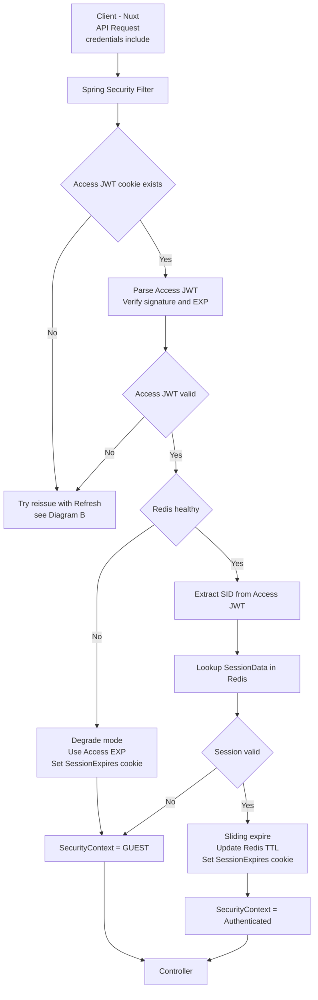

```mermaid
flowchart TD
    A[Client - Nuxt<br/>API Request<br/>credentials include]
      --> B[Spring Security Filter]

    B --> C{Access JWT cookie exists}
    C -- No --> R0[Try reissue with Refresh<br/>see Diagram B]

    C -- Yes --> D[Parse Access JWT<br/>Verify signature and EXP]
    D --> E{Access JWT valid}
    E -- No --> R0

    E -- Yes --> F{Redis healthy}
    F -- No --> DM[Degrade mode<br/>Use Access EXP<br/>Set SessionExpires cookie]
    DM --> G[SecurityContext = GUEST]
    G --> Z[Controller]

    F -- Yes --> H[Extract SID from Access JWT]
    H --> I[Lookup SessionData in Redis]
    I --> J{Session valid}
    J -- No --> G
    J -- Yes --> K[Sliding expire<br/>Update Redis TTL<br/>Set SessionExpires cookie]
    K --> L[SecurityContext = Authenticated]
    L --> Z

```
