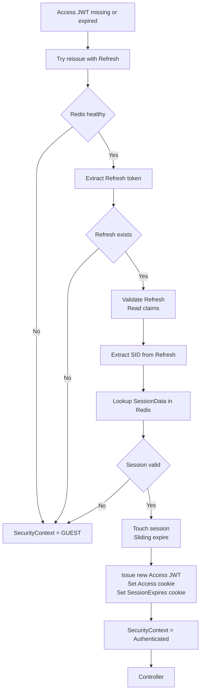

```mermaid
flowchart TD
    A[Access JWT missing or expired]
      --> B[Try reissue with Refresh]

    B --> C{Redis healthy}
    C -- No --> G[SecurityContext = GUEST]

    C -- Yes --> D[Extract Refresh token]
    D --> E{Refresh exists}
    E -- No --> G

    E -- Yes --> F[Validate Refresh<br/>Read claims]
    F --> H[Extract SID from Refresh]
    H --> I[Lookup SessionData in Redis]
    I --> J{Session valid}

    J -- No --> G
    J -- Yes --> K[Touch session<br/>Sliding expire]
    K --> L[Issue new Access JWT<br/>Set Access cookie<br/>Set SessionExpires cookie]
    L --> M[SecurityContext = Authenticated]
    M --> Z[Controller]
```
